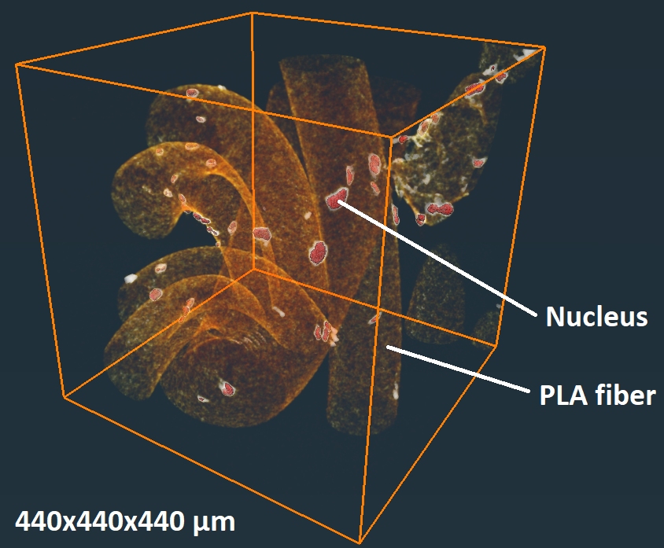

# ThreeDROQA

Introduction

This MATLAB code (ThreeDROQA function) is part of the 3D-Round-Object-Quantification Algorithm (3DROQA). The code can be used to calculate and tabulate spatial and intensity measurements for round objects segmented from 3D-image data. The code takes 3D intensity and segmented binary data as inputs and transforms the found voxel particles into ellipsoids via intermediate polygon particles. Using the particles, the code calculates various measures for each subject object, including shape, dimensional, and intensity values. The code also monitors the data quality by excluding hyperboloids (an indication of proximate under-segmented particles) and calculating ellipsoid-to-voxels volume ratios (extreme ratios far from 1 indicate issues in the particle quality or transformation process). The tabulated values can then be used for making statistical tests. For more information, the 3DROQA was published as a part of Tamminen I. et al. Communications biology (2020).

How to use

The ThreeDROQA function can be used to process voxel-based 3D-particle data representing various round objects. Particles should not touch the data borders. That is why the processed data should be first treated with a border_kill function in an appropriate software (such as in Avizo) before running the ThreeDROQA function in MATLAB. In this package, we provide a small 3D test data that can be used for running the code. In the Test_sets folder, there are .mat and .raw files already processed with border_kill. Mat files can be directly used. Raw files can be read to Matlab with the provided read_raw function. The ThreeDROQA function call is as follows:

ThreeDROQA(segmented data, grayscale data, voxel size, result data,  accepted, lower limit, upper limit);

Segmented data is 8-bit segmented data. Grayscale data is 16-bit original grayscale data. Result data, accepted, lower and upper limits affect the result particles saved in a new .raw volume after the process. The function parameters are described more detailed in the code.

To run a test with the provided 3D data in .mat format, the following command can be executed in MATLAB: 

ThreeDROQA(segmented_matlab, grayscale_matlab, 1.10114, 0, 0, 0.8, 1.2);

After processing the data, ThreeDROQA function outputs an Excel file that contains the following information for each subject object: 
the object number, the volume of the voxel particle, the surface area of the polygon particle, the mean intensity of the voxel particle, the axial lengths (radii) of the ellipsoid (max, medium, min), the flatness, elongation, anisotropy, and sphericity shape values, the volume of the ellipsoid, and the ellipsoid-to-voxels volume ratio.

Preview on the provided 3D test data - segmented antibody-labeled nuclei on biomaterial fibers:

Other matter

The software package includes three third-party libraries/functions listed below: 

iso2mesh by Qianqian Fang https://github.com/fangq/iso2mesh

ellipsoid_fit_new by Yury Petrov https://se.mathworks.com/matlabcentral/fileexchange/24693-ellipsoid-fit

stlVolume by Krishnan Suresh https://se.mathworks.com/matlabcentral/fileexchange/26982-volume-of-a-surface-triangulation

The iso2mesh was published under GPL v2 license. The ellipsoid_fit_new and stlVolume were published under the following license: 

"All rights reserved.

Redistribution and use in source and binary forms, with or without
modification, are permitted provided that the following conditions are met:

* Redistributions of source code must retain the above copyright notice, this
  list of conditions and the following disclaimer.

* Redistributions in binary form must reproduce the above copyright notice,
  this list of conditions and the following disclaimer in the documentation
  and/or other materials provided with the distribution
THIS SOFTWARE IS PROVIDED BY THE COPYRIGHT HOLDERS AND CONTRIBUTORS "AS IS"
AND ANY EXPRESS OR IMPLIED WARRANTIES, INCLUDING, BUT NOT LIMITED TO, THE
IMPLIED WARRANTIES OF MERCHANTABILITY AND FITNESS FOR A PARTICULAR PURPOSE ARE
DISCLAIMED. IN NO EVENT SHALL THE COPYRIGHT OWNER OR CONTRIBUTORS BE LIABLE
FOR ANY DIRECT, INDIRECT, INCIDENTAL, SPECIAL, EXEMPLARY, OR CONSEQUENTIAL
DAMAGES (INCLUDING, BUT NOT LIMITED TO, PROCUREMENT OF SUBSTITUTE GOODS OR
SERVICES; LOSS OF USE, DATA, OR PROFITS; OR BUSINESS INTERRUPTION) HOWEVER
CAUSED AND ON ANY THEORY OF LIABILITY, WHETHER IN CONTRACT, STRICT LIABILITY,
OR TORT (INCLUDING NEGLIGENCE OR OTHERWISE) ARISING IN ANY WAY OUT OF THE USE
OF THIS SOFTWARE, EVEN IF ADVISED OF THE POSSIBILITY OF SUCH DAMAGE."
